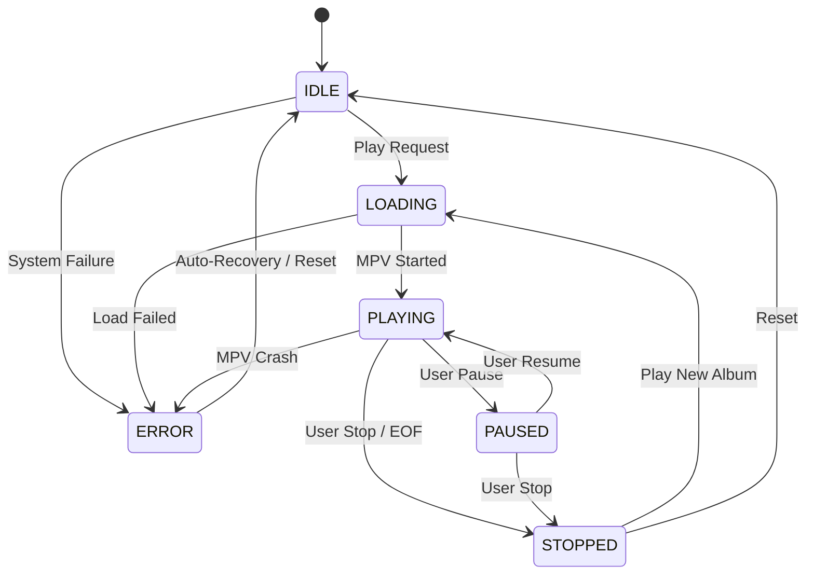

# HMC v2.1 Architecture

## 1. Components & Responsibilities

### Frontend (`/frontend`)
- **Type:** Single Page Application (HTML/JS/CSS)
- **Role:** Pure Renderer (View)
- **Responsibility:**
  - Display libraries, artists, albums, tracks
  - Send user intent (Play, Pause, Stop) to Backend
  - Poll Backend for current state
  - **No Logic:** Does not maintain playback state locally.
  - **Kiosk:** Blocks context menus and unauthorized navigation.

### Backend (`/backend`)
- **Type:** FastAPI (Python)
- **Role:** Central Controller & Single Source of Truth
- **Responsibility:**
  - **API:** Exposes REST endpoints for Frontend & Home Assistant
  - **Policy:** Enforces user restrictions (allowed libraries, volume limits)
  - **Integration:** Fetches metadata from Jellyfin
  - **Control:** Manages MPV process via IPC

### Player (MPV)
- **Type:** External Process (`mpv`)
- **Role:** Audio Engine
- **Responsibility:**
  - Decode and play audio files
  - Connect to ALSA (USB Audio)
  - Report events (EOF, Time) to Backend via IPC Socket

### Jellyfin
- **Type:** External Server
- **Role:** Media Source
- **Responsibility:**
  - Host audio files
  - Provide metadata (Images, Track names)

## 2. Data Flow

1.  **Browse:** Frontend -> GET /libraries -> Backend -> Jellyfin API -> Backend (Filter) -> Frontend
2.  **Play:** Frontend -> POST /play/album/{id} -> Backend -> Jellyfin (Get Tracks) -> MPV (Load Playlist) -> Backend (Update State)
3.  **Update:** Frontend (Poll) -> GET /player/state -> Backend -> Return current internal state

## 3. State Machine

The Backend maintains the authoritative state (`PlaybackState`).

### State Definitions
- **IDLE:** Player ready, no playlist loaded.
- **LOADING:** Fetching tracks from Jellyfin, starting MPV.
- **PLAYING:** Audio is outputting.
- **PAUSED:** Playback suspended, resume possible.
- **STOPPED:** Playback ended or manually stopped. Playlist cleared.
- **ERROR:** Internal error or MPV crash. Needs recovery.
